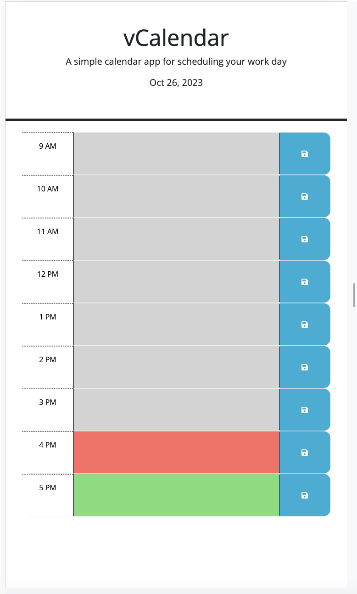
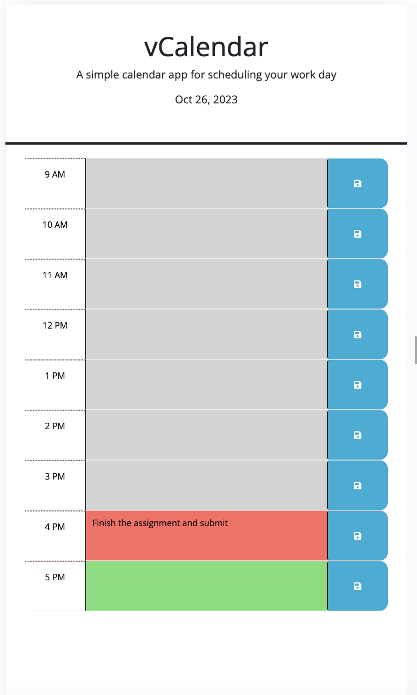

# vCalendar

## Description

This webpage was created to demonstrate the knowledge gained in the Third-party APIs week in coding boot camp and as a part of the class assignment submission. The vCalendar page was developed using HTML, CSS, JS technology, and third-party APIs like jQuery, Bootstrap, and Dayjs. The online daily calendar application will help the user maintain daily tasks hourly from 9 to 5 p.m. Each time block will have different colors depending on the current time. For instance, the past time will follow a gray background color, the current time will follow a red background color, and the future will follow a green background color. The vCalendar allows the user to update the event description against each time block and save them. The data is stored in the local storage provision daily. The data will be retrieved from the specific day's local storage and restored in the respective text area.

## Installation

N/A

## Usage

To access the webpage, use the below link to access https://vigneshwarie.github.io/vCalendar/

The application source code can be accessed here https://github.com/Vigneshwarie/vCalendar

The code can be downloaded from the above link. To use this webpage, click the HTML page, which will open in the browser. The view the code, open the webpage in an HTML editor. When opened in a browser, the HTML page is viewed as below.

## Credits

Referred this link to access the dynamically created element.  https://stackoverflow.com/questions/21064724/jquery-get-id-value-from-dynamically-created-div

